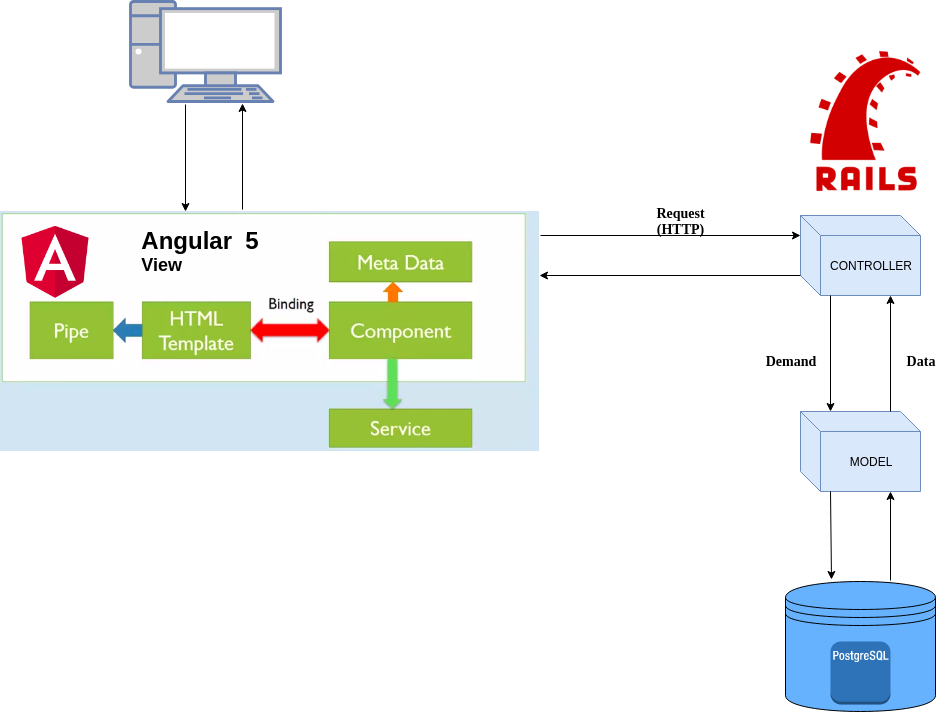
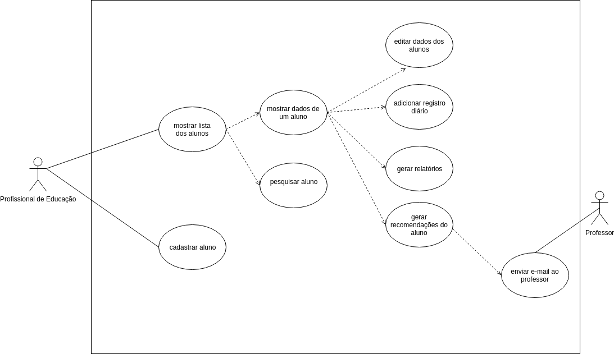
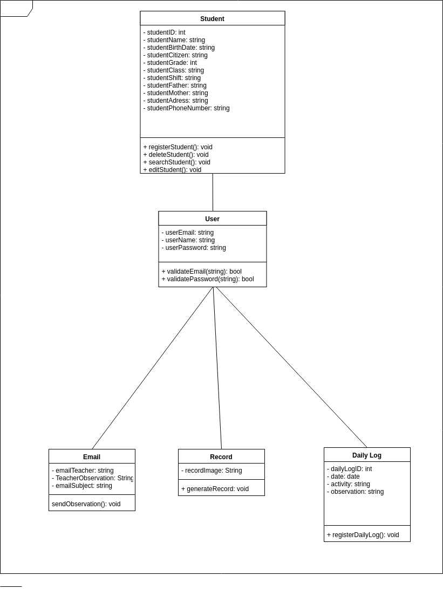

# Documento de Arquitetura

## Histórico de Revisão

|Data|Versão|Descrição|Autor|
|----|----|----|----|
|26/03/2018|0.1|Feitas as seções 1.1, 1.2, 1.4 e 1.5 |Gabriel Alves|
|26/03/2018|0.2|Feita seção 1.3|Igor Veludo|
|27/03/2018|0.3|Feitas a seção 2|Byron Kamal|
|29/03/2018|0.5|Feita as seções 4 e 7| William Almeida|
30/03/2018|0.4|Feita a seção 3 | Igor Veludo, Igor Aragão, Gabriel Alves, João Mota, Marcelo Araujo, William Almeida |
|30/03/2018|0.6|Alterações 4.2|Igor Veludo, Joao Mota|
|02/04/2018|0.7|Correção do topico 3|Byron Kamal|
|02/04/2018|0.8|Feita seção 5|Igor Veludo|
|02/04/2018|0.9|Feita seção 6|Igor Veludo, Byron Kamal|

------------------------------------------------------------

# Índice
1. [Introdução](#1-introdução)

    1.1. [Finalidade](#11-finalidade)  
    1.2. [Escopo](#12-escopo)  
    1.3. [Definições, acrônimos e abreviações](#13-definições-acrônimos-e-abreviações)  
    1.4. [Referências](#14-referências)  
    1.5. [Visão Geral](#15-visão-geral)  
  
2. [Representação da Arquitetura](#2-representação-da-arquitetura)

    2.1. [Angular CLI 1.7.3](#21-angular-cli-173)  
    2.2. [Ruby on Rails 5.1.4](#22-ruby-on-rails-514)

3. [Metas e restrições da arquitetura](#3-metas-e-restrições-de-arquitetura)

4. [Visão de Casos de Usos](#4-visão-de-casos-de-uso)

    4.1. [Atores de Casos de Uso](#41-atores-de-casos-de-uso)  
    4.2. [Visão dos Casos de Uso](#42-visão-dos-casos-de-uso)  
    4.3. [Descrições dos Casos de Uso](#43-descrições-dos-casos-de-uso)  

5. [Visão Lógica](#5-visão-lógica)

    5.1.1. [Diagrama de Classe](#511-diagrama-de-classe)
    
6. [Visão de Implementação](#6-visão-de-implementação)

7. [Tamanho e desempenho](#7-tamanho-e-desempenho)

## 1. Introdução

### 1.1 Finalidade
Este documento tem como objetivo demonstrar a arquitetura selecionada para o projeto IncluCare. O documento é composto por diversos métodos auxiliadores, tais como, diagrama de casos de uso, para facilitar a visualização do processo. Tendo como foco também mostrar que a arquitetura escolhida atende os requisitos exigidos pelo cliente, como desempenho, segurança, disponibilidade, integridade e flexibilidade.  
### 1.2 Escopo
Neste documento é descrito as camadas arquiteturais do projeto, abrangendo as tecnologias utilizadas para sua implementação com seus respectivos framework e ambientes de trabalho. O documento demonstra também, aspectos como desempenho e qualidade.

### 1.3 Definições, Acrônimos e Abreviações
Alguns dos acrônimos, definições e abreviações usados neste documento são:
MVC - Arquitetura padrão Model View Controller.
Angular CLI - Angular Command Line Interface.
RoR - Ruby on Rails, framework de criacao de aplicacoes web.
API - Application Programming Interface.
CSS - Cascading Style Sheets, usado para adicionar estilo a um documento web.
HTML - HyperText Markup Language, linguagem padrão para construção de páginas web.
HTTP - HyperText Transfer Protocol, é um protocolo de comunicação web.

### 1.4 Referências

#### Linguagem Ruby

Site Oficial Ruby - Linguagem Ruby. Disponível em: https://www.ruby-lang.org/pt/. Acesso em: 27 de março de 2018;

Site Oficial Rails - Framework Rails. Disponível em: http://rubyonrails.org/. Acesso em: 23 de março de 2018;

#### Angular

Site Oficial Angular - Angular. Disponivel em :https://cli.angular.io/. Acesso em 23 de março de 2018.

#### Linguagem JavaScript

Site Oficial javaScript - Linguagem JavaScript. Disponível em: https://www.javascript.com/. Acesso em: 27 de março de 2018;

Site Oficial Angular - Framework Angular. Disponível em: https://angularjs.org/. Acesso em: 27 de março de 2018;

#### Documento de Arquitetura

Linha de Código - Como documentar a arquitetura de software. Disponível em: http://www.linhadecodigo.com.br/artigo/3343/como-documentar-a-arquitetura-de-software.aspx. Acesso em: 27 de março de 2018;

### 1.5 Visão Geral
Este artefato descreve uma visão detalhada da arquitetura utilizada para o desenvolvimento do software. O documento foi elaborado e dividido com as seguintes etapas: representação arquitetural, metas e restrições, casos de uso, lógica, implementação e tamanho e desempenho do software. 

## 2. Representação da Arquitetura
A arquitetura será uma adaptação do Model-View-Controller, sendo aquela separada em duas frentes: front-end e API. Para que isso ocorra existirá uma integração entre duas tecnologias, o Ruby on Rails 5.1.4 e o Angular5. A comunicação entre os frameworks é feita por protocolos HTTP.

### 2.1 Angular5
Angular é uma framework baseado em JavaScript mantido pela Google e foi projetado para facilitar o desenvolvimento de aplicações web e tornar o código mais modularizado. Este framework é baseado na arquitetura MVC, porém neste projeto o Angular5 tem a função de View-Controller. Todas as requisições feitas pelo usuários passam pelo View e depois para Controller, e este envia as requisições para a API (desenvolvida em Ruby on Rails) que fará o processamentos necessários dos dados.

### 2.2 Ruby on Rails 5.1.4
O framework Rails é utilizado na linguagem Ruby. A arquitetura deste framework é organizada no sistema em três partes distintas: Modelo, controle e visão. Para este projeto são utilizadas as partes Modelo e Controle, pois o papel de view é executado pelo Angular5.
A camada de modelo (Model) é o lugar onde os dados são estruturados, consultados e validados. Ela se conecta diretamente com a camada de controle pois a camada de controle que irá definir quais dados serão consultados para que a camada de modelo faça conexão com a base de dados, e retorne sua resposta baseando-se nos dados analisados ou alterados. 
A camada de controle (Controller) é a camada que faz a ligação entre usuário e os dados, tendo importância dentro da arquitetura. Para que essa camada execute os métodos ela recebe os comandos passados pelo usuário através da camada de visão e manipula os dados recebidos da camada de modelo.

## 3. Metas e Restrições de Arquitetura

O sistema a ser desenvolvido será suportado por navegadores web como Mozilla Firefox e Google Chrome, sendo otimizado para este último por conta de possuir recursos, em sua maioria, superiores aos outros navegadores disponíveis no mercado, além de abranger a maior parte dos usuários de navegadores desktop.
O back-end será implementado usando a linguagem de programação Ruby, versão 2.5.0, no framework de desenvolvimento Rails na versão 5.1.4 enquanto o front-end será implementado utilizando o framework de desenvolvimento Angular CLI 1.7.3.
O software por possuir uma base de dados pessoais bastante pertinente dos alunos deverá manter estes dados em segurança dentro da base de dados do sistema, assim como as credenciais de usuários se tornam necessárias para a filtragem de recursos dentro da aplicação.

## 4. Visão de Casos de Uso

### 4.1 Atores de Casos de Uso
|  Ator  |  Descrição  |
|----|----|
| Administrador | O administrador irá gerenciar os dados do corpo docente e poderá gerenciar os dados dos alunos |
| Profissional de educação | Os membros do corpo docente poderão manter e consultar os dados dos alunos |

### 4.2 Visão dos Casos de Uso

### 4.3 Descrições dos Casos de Uso

|  Caso de Uso  |  Descrição  |
|----|----|
| UC01 - Fazer login | Credenciamento para acessar as funcionalidades do sistema |
| UC02 - Manter alunos | Criar, acessar, editar ou deletar um aluno |
| UC03 - Manter corpo docente | Criar, acessar, editar ou deletar um membro do corpo docente |
| UC04 - Manter relatório | Criar, editar, acessar ou deletar o relatório de um aluno |
| UC05 - Visualizar Registro Diario | Acessar o registro diario de cada aluno |
| UC06 - Notificar professores | Mandar recomendações para os professores |
| UC07 - Gerar recomendações | Gerar recomendações de cada aluno |
| UC08 - Criar Registro Diário | Criar registro diário das reuniões |

## 5. Visão Lógica
### 5.1.1 Diagrama de Classe

## 6. Visão de Implementação
No front-end ficam os arquivos HTML e CSS, que são referentes a parte visual do projeto. Eles serão implementadas a partir do framework Angular CLI. O Angular fará a comunicação a API através de requisições HTTP.
O back-end é responsável por receber as requisições HTTP e fazer a conexão com o banco de dados. O conjunto Model-Controller, desenvolvida em RoR, controla, acessa e mantém o relacionamento entre objetos e o banco de dados, fazendo as validações necessárias. Em RoR a camada Model é implementada pela biblioteca ActionRecord que oferece uma interface de relacionamento entre as tabelas do banco de dados e o código do programa.

## 7. Tamanho e Desempenho
A Escola Classe 401 possui um pouco mais de 900 alunos, então sistema precisará de uma forma eficiente para guardar os dados dos mesmos. O processamento de dados não será uma grande exigência, já que os relatórios são criados ou editados em um intervalo razoável de tempo. O desempenho do sistema dependerá principalmente da máquina e do navegador utilizados em seu uso. 

